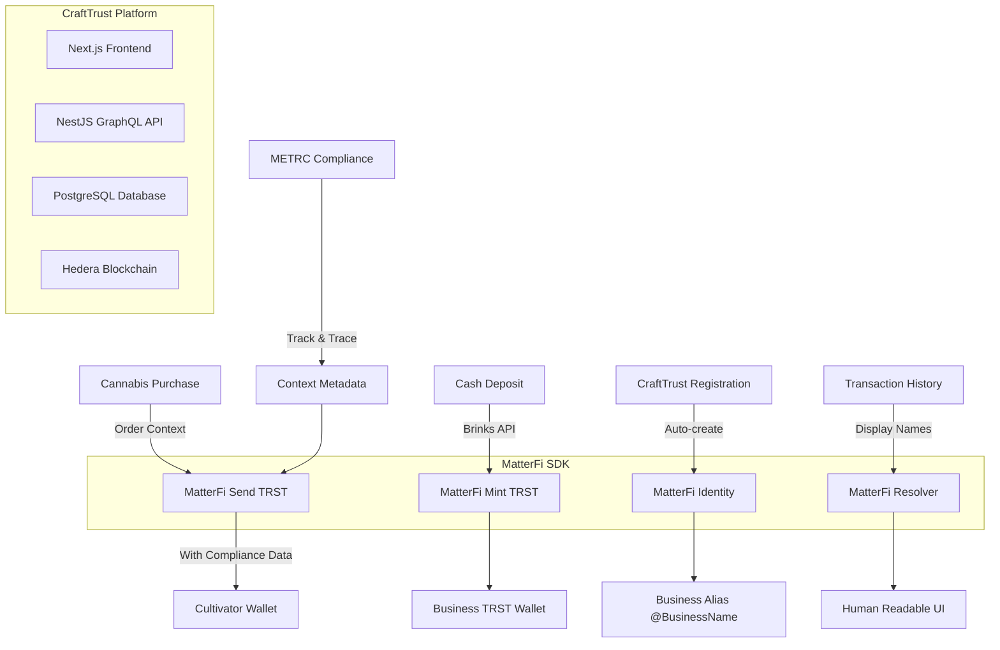

# 🚀 MatterFi SDK Integration Plan - CraftTrust Cannabis Platform

**Prepared for**: Mehow (MatterFi SDK Integration)  
**Project**: CraftTrust - Enterprise Cannabis Commerce Platform  
**Date**: January 25, 2025  
**Status**: Ready for SDK Integration Planning

---

## 🔍 1. Current State of CraftTrust Stack

### **Live Application Status**
- ✅ **Running locally**: `http://localhost:5000` (Next.js 14.0.3)
- ✅ **Backend**: NestJS + GraphQL + PostgreSQL (30 tables active)
- ✅ **Frontend**: React 18 + TypeScript + Material-UI
- ✅ **Admin Interface**: Fully functional with navigation
- ✅ **Database**: Connected with complete schema (orders, products, transactions)

### **Current Tech Stack Overview**
```typescript
Frontend: Next.js 14 + React 18 + TypeScript + Apollo Client
Backend:  NestJS + TypeORM + PostgreSQL + GraphQL
Blockchain: Hedera Hashgraph (testnet ready)
Payment: CARAT tokens → Migrating to TRST
Auth: Magic SDK (Hedera extension) - needs configuration
Storage: Google Cloud + IPFS (Pinata)
```

### **Context Engine Status**
- 🟢 **Messaging Loop**: Twilio SMS + in-app messaging system ready
- 🟡 **Payments Loop**: CARAT implementation complete, TRST migration planned
- 🟡 **Engagement Loop**: NFT reward system architected, needs activation

### **Canonical Folder Structure**
```
crafttrust/
├── pages/                    # Next.js routing
│   ├── admin/               # Admin dashboard
│   ├── client/              # Buyer storefronts  
│   ├── cultivator/          # Seller interfaces
│   └── wallet/              # Payment management
├── src/
│   ├── entities/            # Database models
│   ├── components/          # React components
│   ├── graphql/            # API layer
│   └── utils/              # Shared utilities
├── libs/                    # External service integrations
│   ├── hedera/             # Blockchain operations
│   ├── magic/              # Authentication
│   └── twilio/             # Communications
└── database/               # Schema and migrations
```

---

## 🧩 2. MatterFi Integration Targets

### **Primary SDK Functions Needed**

#### **Business Identity Management**
```typescript
// Triggered on facility registration
await matterFi.createIdentity({
  name: "Green Leaf Dispensary",
  type: "cannabis_facility", 
  taxId: "CA-123456789",
  license: "CDPH-10001234",
  address: { /* facility location */ }
});
```

#### **Alias Registration for B2B Payments**
```typescript
// Enable send-to-name functionality
await matterFi.registerName({
  handle: "@GreenLeafDispensary",
  walletAddress: "0.0.1234567",
  facilityId: "facility_uuid"
});
```

#### **TRST Token Minting (Cash Receipt Integration)**
```typescript
// Triggered by Brinks cash deposit confirmation
await matterFi.mint({
  amount: 15000, // USD amount
  recipient: "0.0.1234567", // Business wallet
  source: "brinks_vault_deposit_id_789",
  metadata: {
    facilityId: "facility_uuid",
    depositDate: "2025-01-25",
    receiptNumber: "BRK-2025-001"
  }
});
```

#### **Contextual B2B Payments**
```typescript
// Cannabis industry B2B payment with compliance context
await matterFi.send({
  to: "@CultivatorCo",
  amount: 2500,
  context: {
    type: "cannabis_purchase",
    invoiceId: "INV-2025-001",
    orderItems: [
      { strain: "Blue Dream", quantity: "2.5 lb", price: 1000 },
      { strain: "OG Kush", quantity: "1.5 lb", price: 1500 }
    ],
    metrcTrackingIds: ["1A4000000000022000000001", "1A4000000000022000000002"],
    complianceHash: "0xabc123..."
  }
});
```

#### **Display Name Resolution**
```typescript
// For transaction history and UI display
const senderName = await matterFi.getDisplayName("0.0.1234567");
// Returns: "Green Leaf Dispensary" instead of wallet address
```

### **Integration Points in CraftTrust**

1. **Order Checkout Flow** (`src/components/Client/ClientCheckout/`)
   - Replace CARAT payment with MatterFi TRST send
   - Add contextual metadata for cannabis compliance

2. **Facility Registration** (`src/entities/facility/`)
   - Create MatterFi identity on facility approval
   - Register business alias for payments

3. **Transaction History** (`src/components/Admin/AdminTransactions/`)
   - Display human-readable names via getDisplayName()
   - Show contextual payment metadata

4. **Wallet Management** (`pages/wallet/`)
   - MatterFi wallet balance integration
   - TRST deposit/withdrawal flows

---

## 🧠 3. Desired UX Philosophy

### **Core Principles**
- 🚫 **No "Connect Wallet" UX** - MatterFi handles wallet creation invisibly
- ✅ **Every user gets a wallet** - Automatic at business registration
- ✅ **Contextual payments** - "Pay Green Leaf for Order #123" not raw transfers
- ✅ **Cannabis compliance first** - All payments include METRC tracking data
- ✅ **B2B focus** - Dispensary-to-cultivator commerce, not consumer DeFi

### **User Journey**
1. **Business Registration** → Auto-create MatterFi identity + wallet
2. **Cash Deposit** → Brinks integration triggers TRST mint
3. **Product Purchase** → Contextual payment with compliance metadata
4. **Transaction History** → Human-readable names and business context

---

## 📋 4. Demo Flow Implementation

### **Current Mock Implementation**
```typescript
// src/entities/order/order.resolver.ts - Line 245
async processPayment(orderId: string) {
  // CURRENT CARAT IMPLEMENTATION
  const rate = await DiamondstandardService.getCaratUsd();
  const totalCarat = ceil(order.total / rate, 2);
  
  await hederaService.transferToken({
    token: CONFIG.hedera.token, // CARAT token
    count: totalCarat
  });
}
```

### **Proposed MatterFi Integration**
```typescript
// REPLACE WITH MATTERFI SDK
async processPayment(orderId: string) {
  const order = await this.orderRepository.findOne({ id: orderId });
  
  // Create contextual payment
  await matterFi.send({
    to: `@${order.facilityCultivator.businessName}`,
    amount: order.total, // Direct USD amount (TRST 1:1 peg)
    context: {
      type: "cannabis_b2b_purchase",
      orderId: order.id,
      items: order.products.map(p => ({
        strain: p.parentProduct.name,
        quantity: `${p.quantity} lb`,
        price: p.total,
        metrcId: p.parentProduct.metrcId
      })),
      buyerLicense: order.facilityBuyer.license,
      sellerLicense: order.facilityCultivator.license,
      complianceData: {
        metrcTrackingIds: order.products.map(p => p.parentProduct.metrcId),
        labResults: order.products.map(p => p.parentProduct.labResultHash),
        timestamp: new Date().toISOString()
      }
    }
  });
}
```

### **Integration Ready Points**
- ✅ Order creation flow exists and functional
- ✅ Facility management system in place  
- ✅ Transaction recording infrastructure ready
- ✅ Compliance metadata collection active

---

## 📊 5. System Architecture Diagram



---

## ✅ 6. Integration Readiness Checklist

### **✅ Ready Now**
- [x] Local development environment running
- [x] Database schema with 30+ tables populated
- [x] Order processing flow complete
- [x] Facility management system active
- [x] Transaction recording infrastructure
- [x] Cannabis compliance data collection
- [x] Hedera blockchain integration layer

### **🟡 Needs Configuration**
- [ ] Magic SDK keys for authentication
- [ ] MatterFi SDK integration points
- [ ] Brinks cash deposit webhook endpoints
- [ ] TRST token configuration

### **🔴 Integration Dependencies**
- [ ] MatterFi SDK installation and setup
- [ ] Business identity creation flow
- [ ] TRST minting integration with Brinks
- [ ] Contextual payment metadata structure
- [ ] Display name resolution for UI

---

## 🎯 7. Technical Requirements for Mehow

### **What We Need from MatterFi SDK**

1. **NPM Package Installation**
   ```bash
   npm install @matterfi/sdk
   ```

2. **TypeScript Definitions**
   - Complete type definitions for all SDK methods
   - Cannabis-specific metadata interfaces
   - Hedera blockchain compatibility

3. **Configuration Requirements**
   ```typescript
   const matterFi = new MatterFiSDK({
     environment: 'testnet', // or 'mainnet'
     apiKey: process.env.MATTERFI_API_KEY,
     blockchain: 'hedera',
     callbacks: {
       onMint: handleTRSTMint,
       onSend: handlePaymentComplete,
       onError: handleSDKError
     }
   });
   ```

4. **Cannabis Industry Metadata Schema**
   - METRC tracking ID support
   - Cannabis license validation
   - Lab result hash inclusion
   - Compliance timestamp requirements

---

## 📞 Next Steps

1. **Demo Preparation**: Live screen share of running CraftTrust platform
2. **SDK Integration Points**: Review specific function calls needed
3. **Metadata Structure**: Define cannabis compliance data format
4. **Testing Strategy**: Testnet integration approach
5. **Production Timeline**: Deployment and go-live planning

---

**Contact**: Ready for technical discussion and SDK integration planning.  
**Repository**: CraftTrust platform running locally with full commerce flow active.  
**Integration Status**: Architecture complete, awaiting MatterFi SDK configuration.